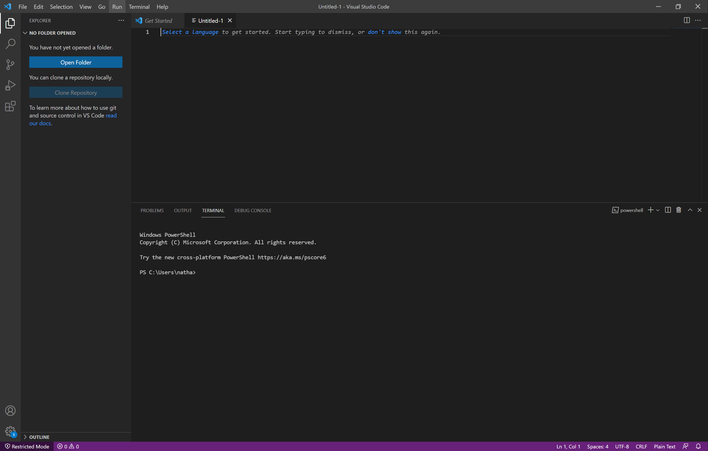

# Lab Report 1

*This report will take you through the processes I completed in lab 1 during week.*

> **Installing VScode**
- Personally I had VScode installed previously from CSE 12.
- However, the process is very simple. All you have to do is go to the [VScode website](https://code.visualstudio.com/) and click download for your respective software (e.g. windows).
- Then you complete the installations on your local computer.



> **Remotely Conneting**
- In order to remotely connect to a computer in the the CS lab on campus, you can complete the VScode terminal.
- Thus in order to connect to remotely, you need to type in the command ```ssh cs15lwi22***@ieng6.ucd.edu```, where ```ssh``` refers to the secure shell and *** refers to where you substitute your unique username identification.
- Then you need to enter the password you set for this account (initially I believe this is you triton link password, but you can change this password online)


> **Trying Some Commands**
- Within the lab, I personally tested the commands ```cd```, ```ls```, and ```ls -a```.
- These were the ones I was most familiar with, and I believe ```cd``` is the most common one I use in order to connect to the proper directory when I want to run code on the VScode terminal.
- For the other commands which I am not too familiar with, we discussed them together as a lab group and you can find them here in our [lab document](https://docs.google.com/document/d/1Lwlp9BMr4kEop4T5s-LekLiPBEbVE_yRBue9EzupUF4/edit).


> **Moving Files with SCP**
- SCP means to secure copy a file over to the remote server.
- In order to complete this process, you type the command ```scp fileName.java cs15lwi22***@ieng6.ucd.edu:~/``` (where *** again refers to your unique username) and then type in your password.
- In this case, I copied over the WhereAmI.java file to the secure sever.


> **Setting SSH Key**
- Setting an SSH key allows you to log in from your local computer to the remote server without constantly having to type in your pasword.
- In order to generate this key, you use the command ```scp /Users/^^^/.ssh/id_rsa.pub cs15lwi22***@ieng6.ucsd.edu:~/.ssh/authorized_keys```, where ^^^ refer to your local computers path and *** refers to your unique username.
- Then after entering your password one more time, you can now connect to the remote server without requiring a password (in the photo, this takes place in the lower half of the frame).


> **Optimizing Remote Running**
- After speculation, I found that the only way to optimize the remote running time was to have the ssh and scp commands typed out at least once (or copy/paste) and then utilize the up arrow to retrieve previous commands. 
- The commands I am referring to is the ```scp fileName.java cs15lwi22***@ieng6.ucd.edu:~/``` and ```ssh cs15lwi22***@ieng6.ucd.edu javac fileName.java; java fileName```. In this photo, I copied over the WhereAmI.java file and ran it on the remote server.
- However, now that you have typed them in once, you can simply use the up arrow to retrieve the previous commands in order to copy over files and run them on the remote server after making changes locally. Using this method, it took me about 6 keystrokes to repeatedly run these tests.


