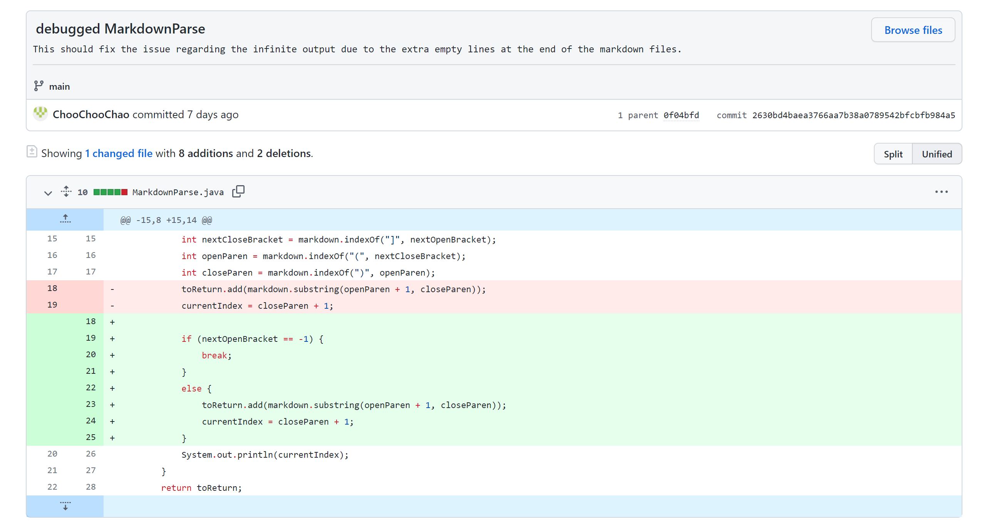
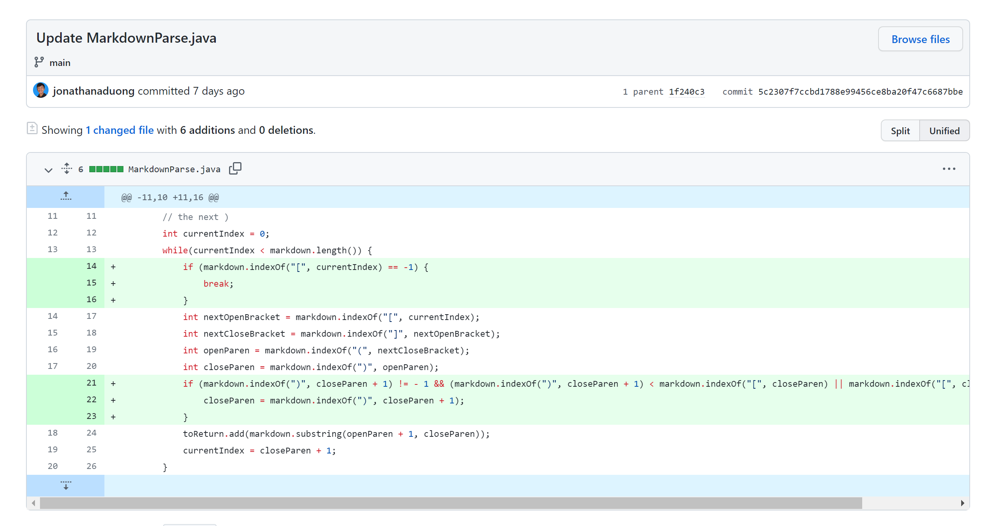
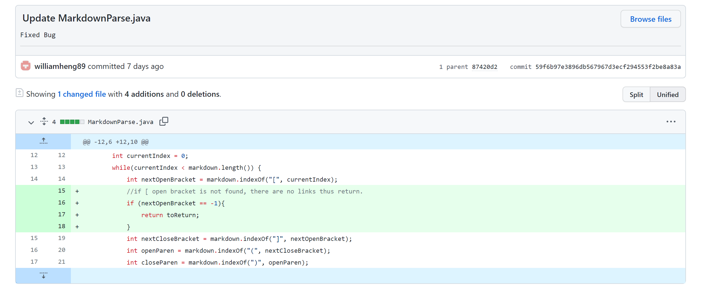

# Lab Report 2

*This report will take you through the incremental programming and debugging practiced over Labs 3 and 4.*

> **BUG 1**

- Attached here is the [link](https://github.com/ChooChooChao/markdown-parse/commit/0f04bfd5aa2b037a428ffc4691d053719b1ef6df#diff-0c888627ccb44d27a24ecdede12f8e703504fd7bd52d792866fe2a3e33b8622a) to the failure inducing-input. 
- You may also find the symptoms in the commit message attached to the input. However, in summary the test file creates an infite loop.
- Based off the input, we found that it was the new/extra lines at the end of the test file that caused the error. This resulted in an infinite output. Thus we changed the code so that it would account for and break the loop after the final set of brackets and parentheses. 

> **BUG 2**

- Attached here is the [link](https://github.com/jonathanaduong/markdown-parse/commit/1f240c328cf956799750a4deb08f3efdf1dc2533) to the failure inducing-input. 
- Below you can see the output results of the failure-inducing code

- Though it is unlikely that there would be extra parentheses within the link, this bug considers such an input. As a result of this, we got a heap space error. We fixed this error by adding a separate check ensuring there are no brackets or parentheses within the first found opening parentheses and final closing parentheses.

> **BUG 3**

- Attached here is the [link](https://github.com/williamheng89/markdown-parse/commit/87420d22b5b01f40acf97baf34e476eeaaf2d682) to the failure inducing-input.
- Below you can see the output resulting from this failure-inducing input.

- Similar to the first bug, this error resulted from extra lines of content without the 
