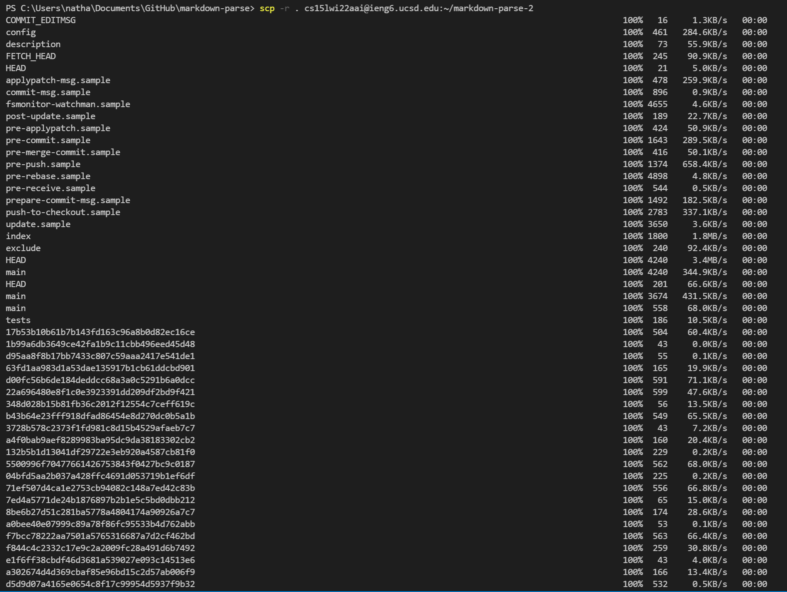
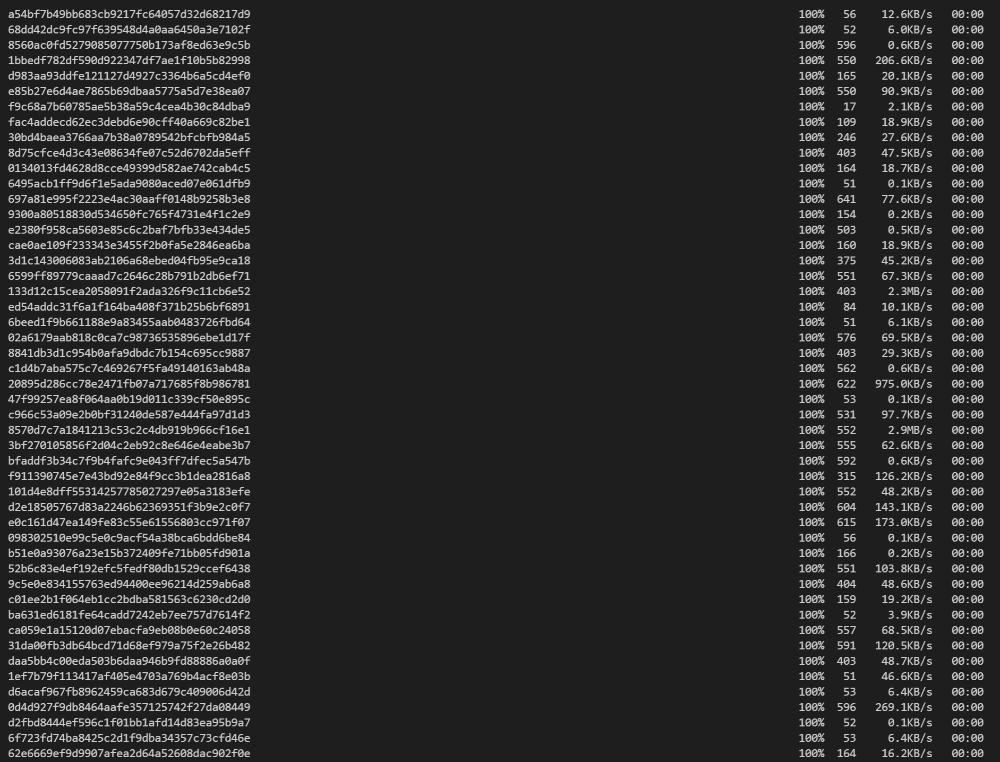
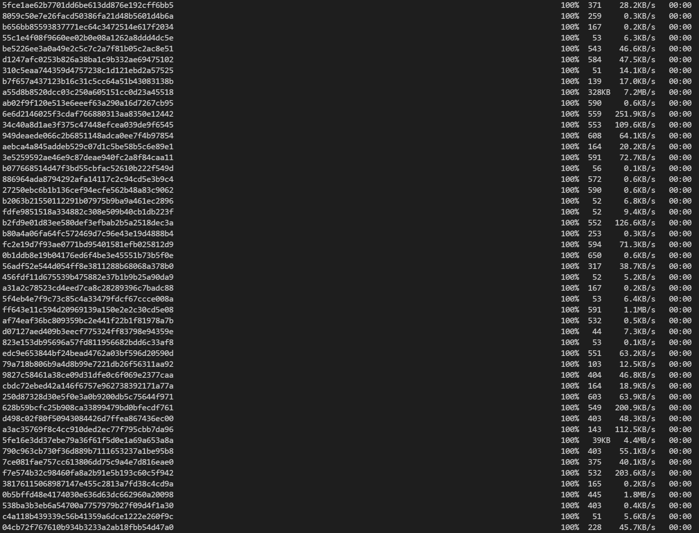
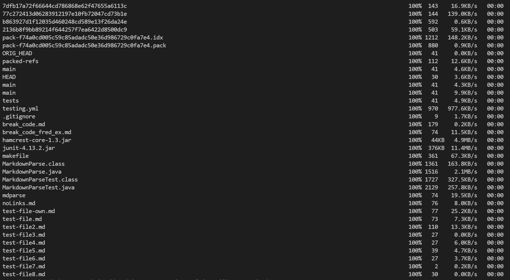
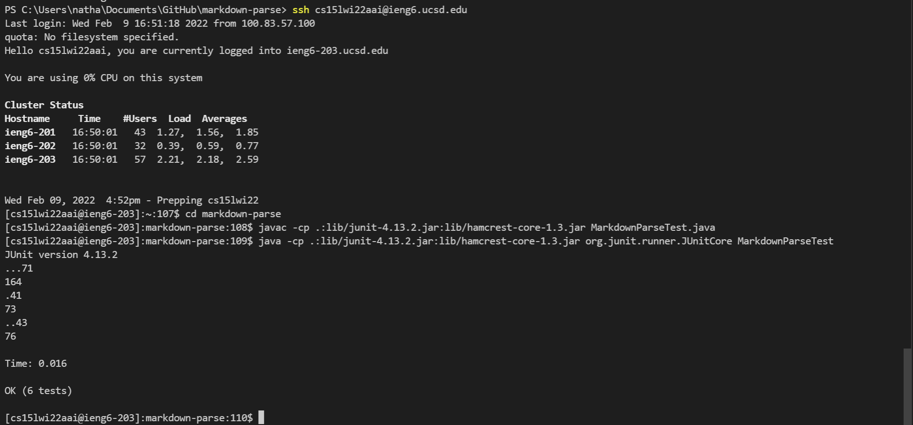
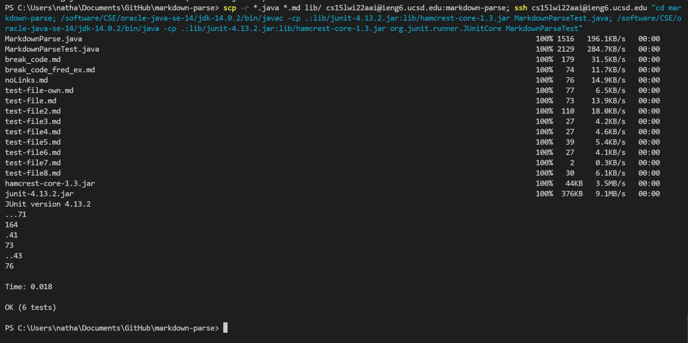

# Lab Report 3

*This report will take you through the process I took in copying the entire markdown-parse directory over to the ieng6 remote servers.*

> **Copying over using ```scp -r```**
- I used the command ```scp -r . cs15lwi22aai@ieng6.ucsd.edu:~/markdown-parse-2``` to copy over the entire directory from my local pc over to the remote server into a new folder/directory called "markdown-parse-2."







> **Logging in and Testing**
- Below are the screenshots showing how I ```ssh``` to the remote server, compiling, and running the code.



> **Combining the process**
- Here I combined the ```scp```, ```ssh```, compile, and run commands.
- Specifically I used ```scp -r *.java *.md lib/ cs15lwi22aai@ieng6.ucsd.edu:markdown-parse; ssh cs15lwi22aai@ieng6.ucsd.edu "cd markdown-parse; /software/CSE/oracle-java-se-14/jdk-14.0.2/bin/javac -cp .:lib/junit-4.13.2.jar:lib/hamcrest-core-1.3.jar MarkdownParseTest.java; /software/CSE/oracle-java-se-14/jdk-14.0.2/bin/java -cp .:lib/junit-4.13.2.jar:lib/hamcrest-core-1.3.jar org.junit.runner.JUnitCore MarkdownParseTest"```
- The first part copies the all of the ```.java``` and  ```.md``` files over to the remote server.  
- The second part connects to the remote server.
- Third, it uses ```cd``` to access the markdown-parse directory on the remote server.
- Then it finally uses the commands to compile and run the junit tests within MarkdownParseTest.java.


