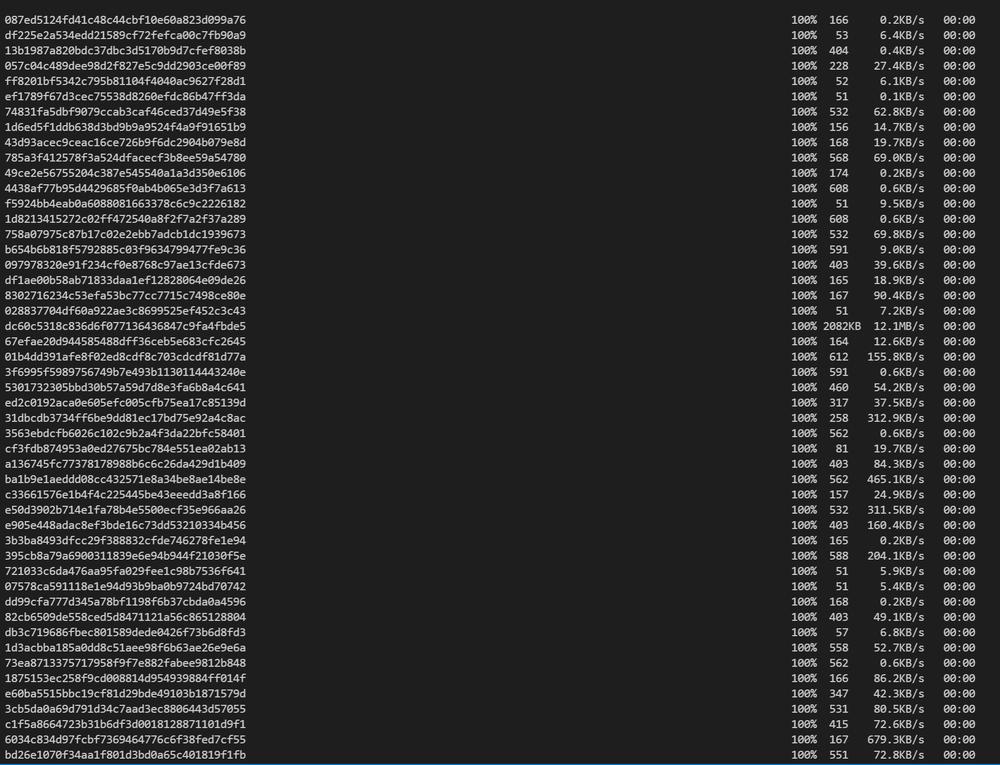

# Lab Report 3

*This report will take you through the process I took in copying the entire markdown-parse directory over to the ieng6 remote servers.*

> **Copying over using ```scp -r```**
- I used the command ```scp -r . cs15lwi22aai@ieng6.ucsd.edu:~/markdown-parse-2``` to copy over the entire directory from my local pc over to the remote server into a directory called "markdown-parse-2."





> **Logging in and Testing**
- Below are the screenshots showing how I ```ssh``` to the remote server, compiling, and running the code.


> **Combining the process**
- Here I combined the ```scp```, ```ssh```, compile, and run commands.
- Specifically I used ```scp -r . cs15lwi22aai@ieng6.ucsd.edu:~/markdown-parse-3; ssh cs15lwi22aai@ieng6.ucsd.edu  "cd markdown-parse-3; javac -cp .:lib/junit-4.13.2.jar:lib/hamcrest-core-1.3.jar MarkdownParseTest.java; java -cp .:lib/junit-4.13.2.jar:lib/hamcrest-core-1.3.jar org.junit.runner.JUnitCore MarkdownParseTest"```
- The first part copies the entire directory from my local PC to a remote directory called "markdown-parse-3." 
- The second part connects to the remote server.
- Third, it uses ```cd``` to access the markdown-parse-3 directory on the remote server.
- Then it finally uses the commands to compile and run the junit tests within MarkdownParseTest.java.
- Though the tests did not compile wihtout error, it still shows the commands on a single terminal line run.


