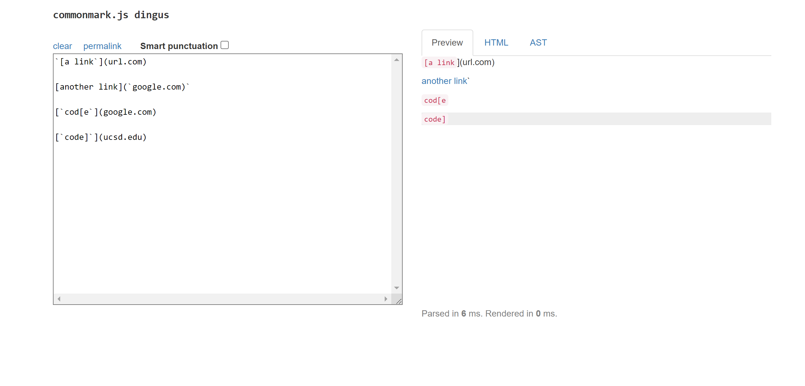
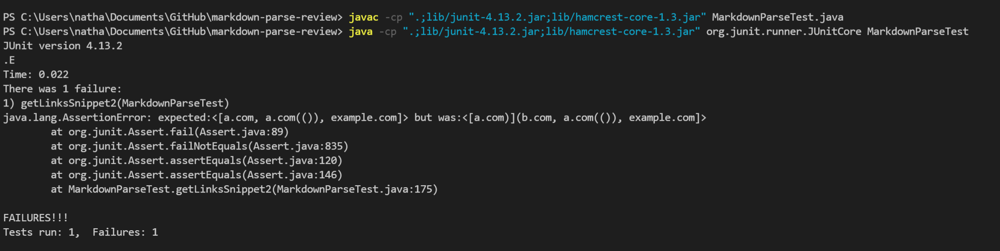

# Lab Report 4

*This report will take you through a comparison between my markdown-parse repository against another groups repo.*

- Please find the link to my repo [here](https://github.com/ChooChooChao/markdown-parse)
- This is the link for the other groups repo [here](https://github.com/bimai25/markdown-parse)

> **Code Snippet 1**
-  Here is the first code snippet



- Based on the preview, I would expect the output to be ```["`google.com", "google.com", "ucsd.edu"]```
- Below is the test method for Snippet1.


- Using this test, my code produces the following failure.


- The other groups code produced the following result.


> **Code Snippet 2**
-  Here is the second code snippet


- Based on the preview, I would expect the output to be ```["a.com", "a.com(())", "example.com"]```
- Below is the test method for Snippet1.


- Using this test, my code produces the following failure.


- The other groups code produced the following result.



> **Code Snippet 3**
-  Here is the third code snippet


- Based on the preview, I would expect the output to be ```["https://ucsd-cse15l-w22.github.io/"]```
- Below is the test method for Snippet1.


- Using this test, my code produces the following failure.


- The other groups code produced the following result.


> **Question Responses**
- I believe that there is a small change that could be made to handle backticks. It would take maybe 6-8 lines of code. You would need an if statement that checks to ensure that there are not two backticks within the link (including right before the opening bracket and right after the closing parentheses).
- I do believe that there is a small change you could make to solve this issue. Again, this may take 6-10 lines depending on style. However, taking inspiration from the group I reviewed, it revolves around using the function lastIndexOf() to find the final iterations of ```](``` and ```)``` in the line. 
- I do not believe there is a small change you could make to solve the issue. It would likely take more than 15 lines. This is because it would be necessary to adjust the way the file is read. Currently we have it so that it reads in each line of ```.md``` file and then checks for a link on that line. To solve this issue, you would need to traverse the file in a manner that does not take in each line of file. 


