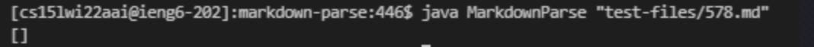

# Lab Report 5

*This report will analyze items we covered in lab 9.*

**How I found the differences**
- During lab 9 and in preparation for this report, I used ```diff``` to identify any differences in the results of ```bash script.sh```.
- Though I did intitially use the command provided in the lab tasks (```diff student-mdparse/results.txt markdown-parse/results.txt```), I still found it difficult to parse the output and identify exactly which markdown files resulted in differences.
- Thus I turned to the internet and found a slighlty different ```diff``` command. I used ```diff -u student-mdparse/results.txt markdown-parse/results.txt```, where the ```-u``` refers to a "unified" version of the differences. I found this [here](https://www.geeksforgeeks.org/diff-command-linux-examples/) on the geeksforgeeks webiste which further states the command "doesn't display redundant information."
- This helped me easily identify which exact files were experiencing different outputs.
- In this lab report I will be focusing on test files "574.md" and "578.md".

**Test File 574**
- Here is a photo of the file itself and its preview on VS code.


- Based on this preview, we can see that the expected output should be ```[]``` as there is no valid link in the file.
- However, both implementations of markdown-parse are incorrect. They both provide an output of ```[/url]```.

- Here is a screenshot of the results from my code.


- Here is a screenshot of the results from the given code.


- Since both files are identifying a similar issue, I believe the bug is being caused by the lack of checks we have within our code. Thus, I will focus on my own implementation, and you can see a specfic section of the code below.


- As you can see within this while loop, my code is only checking for a lack of a opening/closing parentheses, and if there is not closing bracket. It does not account for several pairs of opening/closing brackets and parentheses within the same line. 
- Thus I believe it would be necessary to add a couple more ```if``` statements to check for this issue.
- Another solution I found while reviewing another groups code in lab 7, was using the function ```lastIndexOf()```, which would allow us to focus only on the last instance of opening/closing parentheses within the line.

***Test File 578**
- Here is a photo of the file itself and its preview on VS code.


- Based on this preview, we can see that the expected output should be ```[]``` as there is no valid link in the file.
- However, after differentiating the results, I found that my implementation was incorect, whereas the given code produced the proper output.

- Here is a screenshot of the results from my code.


- Here is a screenshot of the results from the given code.



- I believe this issue is similar to the previous one in that it lacks checks for specific properties. In this case I assume that test file 578 is attempting to insert an image. Thus I believe it is a matter of finding an ```![``` in the line.


- Thus in order to mend this bug, I believe you need another ```if``` statement within the ```while``` loop that specifically checks for a ```![```, which indicates the beginning of an image. Then you can have the code ignore the section of line that starts with ```![``` and ends with a closing parenthese.


